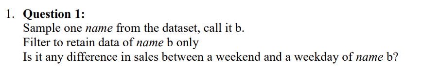
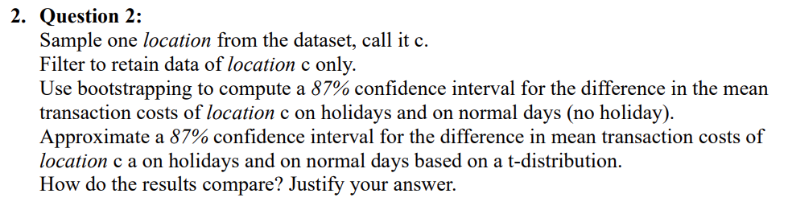
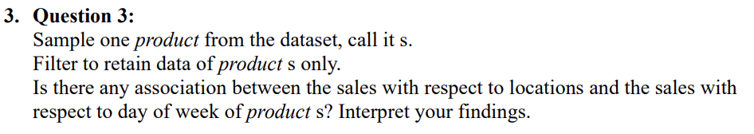
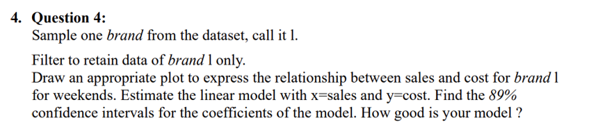
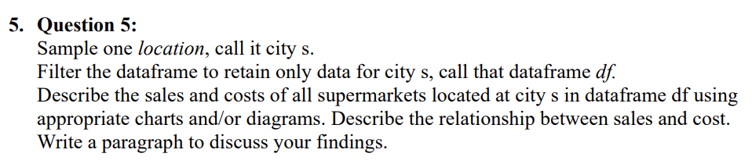

```{r setup, include=FALSE}
knitr::opts_chunk$set(echo = TRUE)
knitr::opts_chunk$set(cache = TRUE)
set.seed(22026908)
```

# Student Detail

Student Surname: "Le" 

Student Firstname: "Huynh Cat Phi" 

Student ID: "22026908"

Subject Name: "Thinking About Data"

Subject Code: "COMP1014"

# Declaration

The following declaration must be included in a clearly visible and readable place on the first page of the report. By including this statement, we the authors of this work, verify that:

• I hold a copy of this assignment that we can produce if the original is lost or damaged.

• I hereby certify that no part of this assignment/product has been copied from any other student’s work or from any other source except where due acknowledgement is made in the assignment.

• No part of this assignment/product has been written/produced for us by another person except where such collaboration has been authorised by the subject lecturer/tutor concerned.

• I am aware that this work may be reproduced and submitted to plagiarism detection 
software programs to detect possible plagiarism (which may retain a copy on its databasefor future plagiarism checking).

• I hereby certify that we have read and understood what the School of Computing and 
Mathematics defines as minor and substantial breaches of misconduct as outlined in the learning guide for this unit.

# Answer Project Question

First of all, we read the file and show the first five rows of the data to have an overview of the data.

```{r}
df = read.csv("sales(1).csv")
head(df,5)
```

## Question 1

```{r echo = FALSE, out.width="150%"}

```

**Answer:**

### a. Sample one name from the dataset, call it b. 

We sample the data by using function sample() and parameter "size = 1" to get one random name of the "name" column.

```{r}
name_b = sample(df$name,size = 1)
name_b
```

### b. Filter to retain data of name b only.

We filter the data of name b only by using the subset() function with the condition "name == name_b" to retain data of name b of the column "name" only.

```{r}
# Subset the data of name_b in the "name" column
df_name_b = subset(df, name == name_b)
head(df_name_b,5)
```

### c. Is it any difference in sales between a weekend and a weekday of name b?

In order to check the difference in sales between a weekend and a weekday of the name b, we use t.test to evaluate. First, we need to prepare the data. We subset the weekend (saturday, sunday) and the weekday (not saturday, sunday) of the df_name_b to compare the difference in sales.

```{r}
df_name_b_weekend = subset(df_name_b, day_of_week %in% c("sat", "sun"))
df_name_b_weekday = subset(df_name_b, !day_of_week %in% c("sat", "sun"))
```

We plot the box plot to see the distribution of the weekday and weekend sales.

```{r}
boxplot(df_name_b_weekday$sales, df_name_b_weekend$sales)
```

We check the sample size of weekend sales and weekday sales to see if the sample size is large enough to make the t.test().

```{r}
table(df_name_b_weekday$day_of_week)
table(df_name_b_weekend$day_of_week)
```

After checking, we can see that the number of observation is large enough (N > 30) therefore we conduct the approximation t.test to check the difference in sales between a weekend and a weekday of name b. Moreover we check the variance between two group to consider the "var.equal" parameter in the t.test() function. Therefore in this case we will calculate the variance of each group and conduct var.test(). 

The null hypothesis (H_0) in this var.test() is the true ratio of variances is equal to 1 (the variances of the two groups are equal). 

The alternative hypothesis (H_a) in this var.test() is the true ratio of variances is not equal to 1 (the variances of the two groups are not equal). 

```{r}
var(df_name_b_weekend$sales)
var(df_name_b_weekday$sales)

var_test = var.test(df_name_b_weekend$sales, df_name_b_weekday$sales)
var_test 
```
With the p-value of 0.8715 that much larger than the significant level of 0.05, we do not reject H0; there is no evidence that true ratio of variances is not equal to 1 (the variances of the two groups are not equal). Therefore, in this case, we use var.equal = TRUE in the t.test in order to conducts a Student's t-test that assumes equal variances between the two groups. 

*Hypothesis Forming*:

H_0 (Null hypothesis): There is no different in mean of weekday sales and mean of weekend sales.

H_a (Alternative hypothesis): There is different in mean of weekday sales and mean of weekend sales.

```{r}
t_test_result = t.test(df_name_b_weekday$sales, df_name_b_weekend$sales, var.equal = TRUE)
print(t_test_result)
```

With the assumption of significant level at 0.05, we extract p-value of the t.test() to make the conclusion.

```{r}
p_value_b = t_test_result$p.value
p_value_b
```

**Conclusion:**

We assume the significant level at 0.05. With the name of the supermarket D, and given that the p-value of 0.162 is greater than the significance level of 0.05, we do not reject the null hypothesis (H_0). There is not enough evidence for the difference in sales between weekends and weekdays (H_a) for D.

## Question 2

```{r echo = FALSE, out.width="150%"}

```

**Answer:** 

### a. Sample one location from the dataset, call it c. 

We sample the data by using function sample() and parameter "size = 1" to get one random location of the "location" column.

```{r}
name_c = sample(df$location,size = 1)
name_c
```

### b. Filter to retain data of name c only.

We filter the data of name c only by using the subset() function with the condition "location == name_c" to retain data of name c of the column "location" only.

```{r}
# Subset the data of name_b in the "name" column
df_name_c = subset(df, location == name_c)
```

### c.1. Use bootstrapping to compute a 87% confidence interval for the difference in the mean transaction costs of location c on holidays and on normal days (no holiday).

In order to bootstrap, we create another column name "group" and convert Tet and Independence day into group "holiday", while no holiday into group "no holiday".

```{r}
df_name_c$group = ifelse(df_name_c$holiday %in% c("tet", "independence"), "holiday", "no holiday")
head(df_name_c,5)
```

We import the neccessary library to bootstrap.

```{r}
library(boot)
```

We define a function to conduct the mean of cost group holiday and no holiday and then substract the mean to get mean difference.

```{r}
mean_diff = function(d, i) {
  boot_data = d[i, ]
  # Calculate mean of the cost of "holiday" group.
  mean_holiday = mean(boot_data$cost[boot_data$group == "holiday"])
  # Calculate mean of the cost of "no holiday" group.
  mean_noholiday = mean(boot_data$cost[boot_data$group == "no holiday"])
  return(mean_holiday - mean_noholiday)
}
```

We do bootstrapping method 10000 times to get all possible simulated difference. 

```{r}
b = boot(data = df_name_c, statistic = mean_diff, R = 10000)
```

We use boot.ci() function to compute the 87% confidence interval for the difference in mean transaction costs of location c a on holidays and on normal days.

```{r}
ci_boot = boot.ci(b, conf = 0.87, type = "basic")
ci_boot
```

### c.2. Approximate a 87% confidence interval for the difference in mean transaction costs of location c on holidays and on normal days based on a t-distribution.How do the results compare? Justify your answer.

In order to do the approximation t.test(), we must first check the assumption about the sample size of the group of data.

```{r}
table(df_name_c$group)
```

It can be seen that the count (sample size) of each goup is greater than 30 (N >30). We also need to check the variance between mean transaction costs on holidays and on normal day. We conduct the variance calculation between two group and we also conduct var_test() to make the precise calculation. 

The null hypothesis (H_0) of var_test() is true ratio of variances is equal to 1.

The alternative hypothesis (H_1) of var_test() is true ratio of variances is not equal to 1.

```{r}
holiday_group = df_name_c[df_name_c$group == "holiday", "cost"]
no_holiday_group = df_name_c[df_name_c$group == "no holiday", "cost"]

var(holiday_group)
var(no_holiday_group)

var_test1 = var.test(holiday_group, no_holiday_group)
var_test1
```
In this case, with the p value of 0.019 that smaller than the significant level of 0.05, we reject the null hypothesis (H_0) that true ratio of variances is equal to 1. True ratio of variances is not equal to 1 which mean that we must add the parameter "var.equal = FALSE" to get the precise calculation.

Therefore, in this case, we can use t-distribution to find the 87% confidence level of the difference in mean transaction cost. First, we perform the t-test.

```{r}
t_test_result = t.test(cost ~ group, data = df_name_c, conf.level = 0.87, var.equal = FALSE)
```

Second, we extract the confidence interval from the t-test result.

```{r}
t_test_result$conf.int
```

### c.3. How do the results compare ? Justify your answer.

The result of bootstrapping method: 

```{r}
ci_boot
```

The result of t-distribution:

```{r}
t_test_result$conf.int
```

*Conclusion:*

In this case, we can see that the confidence interval from the bootstrapping method has a similar range with the confidence interval conduct from the t.test method. The slight differences between the bootstrap and t-test intervals occurs due to the fact that these methods handle data and assumptions differently. While the t-test is more vulnerable to assumptions being broken (sample size, normality), the bootstrap technique is more robust to the violation of the assumption.

In general, the result of confidence interval conducted from the bootstrapping method and t-test distribution are very close to each other. Since the two intervals are for the same confidence level and provide similar estimates of the difference in mean transaction costs between holidays and normal days, we can conclude that the results from bootstrapping and the t-test are consistent. 

Moreover, the assumptions of t-test (normality or equal variance) is likely met and the sample size is large enough for the t-test to provide reliable result. The bootstrap and t-test results are pretty similar that the t-test's assumption of normality is not dramatically violated, and that the bootstrap method is providing a reasonable estimate.


## Question 3

```{r echo = FALSE, out.width="150%"}

```

**Answer:** 

### a. Sample one product from the dataset, call it s. 

We sample the data by using function sample() and parameter "size = 1" to get one random product of the "product" column.

```{r}
name_s = sample(df$product,size = 1)
name_s
```

### b. Filter to retain data of product s only.

We filter the data of product s only by using the subset() function with the condition "product == name_s" to retain data of product s of the column "product" only.

```{r}
df_name_s = subset(df, product == name_s)
head(df_name_s, 5)
```

### c. Is there any association between the sales with respect to locations and the sales with respect to day of week of product s? Interpret your findings.

First we must see the data type of required variables to determine the suitable test. In this specific case, we evaluate three variables of product s: locations, day of week. 

location: a categorical variable ("sg", "hn", "ct", etc).

day_of_week: a categorical variable ("sat", etc).

Since two variables is two categorical variables therefore in order to understand the association between location and day_of_week, we compute chi-square test to measure.


*Hypothesis Forming:*

The null hypothesis (H_0): There is no association between sales of location and sales of day of the week.

The alternative hypothesis (H_a): There is an association between sales of location and sales of day of the week.

However, before compute chisq.test(), we must first check the expected count of the variables to determine whether to use simulation. First, we group the sales of location and the sales of day of week and create a new variable named "table".

```{r}
table = table(df_name_s$location, df_name_s$day_of_week)
```

Second, we check the assumption of chi square about the expected count of each category.

```{r}
location_count = rowSums(table)
dow_count = colSums(table)

outer(location_count, dow_count) / sum(table)
```

As we can see from the expected count, there are some expected count less than 5. In this case, we must add the simulation parameter in the chisq.test() to make the result more reliable.

```{r}
chisquare = chisq.test(table, simulate.p.value = TRUE, B = 10000)

chisquare$p.value
```

**Conclusion for Question 3:**

We assume the significant level at 0.05. With the product p3 and the p-value of 0.7886211 that greater than 0.05 (significant level) so we do not reject the null hypothesis (H_0). There is not enough evidence for association between the sales with respect to locations and the sales with respect to day of week of the product p3 (H_a).

## Question 4:

```{r echo = FALSE, out.width="120%"}

```

**Answer:** 

### a. Sample one brand from the dataset, call it l.

We sample the data by using function sample() and parameter "size = 1" to get one random brand of the "brand" column.

```{r}
name_l = sample(df$brand,size = 1)
name_l
```

### b. Filter to retain data of brand l only.

We filter the data of brand l only by using the subset() function with the condition "product == name_l" to retain data of product s of the column "brand" only.

```{r}
df_name_l = subset(df, brand == name_l)
head(df_name_l, 5)
```

### c.1. Draw an appropriate plot to express the relationship between sales and cost for brand l for weekends.

We filter the data of brand l for weekends (day_of_week == c("sat", "sun)).

```{r}
df_name_l_weekend = subset(df_name_l, day_of_week %in% c("sat", "sun"))
head(df_name_l_weekend, 5)
```

Sales and cost of the data frame are two quantitative variables therefore the scatter plot is the most suitable plot to express the relationship between two variables.

```{r}
plot(df_name_l_weekend$sales, df_name_l_weekend$cost, 
     xlab = "Sales of the product", 
     ylab = "Cost of the product", pch = 16,
     main = "Sales-Cost relationship of the product")
```

### c.2. Estimate the linear model with x=sales and y=cost. 

We fit the data x = sales and y = cost into linear model by using lm() function.

```{r}
model = lm(cost ~ sales, data = df_name_l_weekend)
```

We plot the linear model into the scatter plot to visualize.

```{r}
plot(df_name_l_weekend$sales, df_name_l_weekend$cost,
     xlab = "Sales of the product",
     ylab = "Cost of the product", pch = 16)

# Add regression line
abline(model, col = "red", lwd = 2)
```

The estimation for a (y-intercept (where the line cross y-axis)) is:

```{r}
coef(model)[1]
```


The estimation for b (slope (steepness of the line)) is:

```{r}
coef(model)[2]
```

The estimation of the linear model with x = sales and y = cost is:
```{r}
cat("The linear model of brand", name_l, "is y =", coef(model)[1], "+" , coef(model)[2], "* x")
```

### c.3. Find the 89% confidence intervals for the coefficients of the model. How good is your model ?

We use bootstrapping method to find the 89% confidence intervals for the coefficients of the model.

#### c.3.1. 89% CI for the a (y-intercept (where the line cross y-axis)) is:
\
We bootstrap the y-intercept (a) of the linear model 10000 times by draw a random sample (with replacement) of size n_a from the original data frame.

```{r}
n_a = nrow(df_name_l_weekend)
x_a = replicate(10000, {
  # Bootstrap sample the data rows
  samp = sample(1:n_a, replace = TRUE, size = n_a)
  fit = lm(cost~sales, data = df_name_l_weekend[samp,])
  coef(fit)[1]
})
```

We plot the distribution of bootstrap result to visualize.

```{r}
hist(x_a)
```

Since this is the two-tailed test, we find the upper and lower tail of the 89% confidence level for the y-intercept of the model. 

```{r}
l_a = quantile(x_a, 0.055)
u_a = quantile(x_a, 0.945)

cat(paste("True y-intercept (a) of the linear model with the 89% Confidence Interval will \n", 
            "belong in the (", round(l_a,4), "," ,round(u_a,4) ,")"))
```

We add the upper and lower line to the histogram to demonstrate the 89% confidence intervals for the y-intercept of the model.

```{r}
hist(x_a)
abline(v=l_a, col="red", lwd = 2)
abline(v=u_a, col="red", lwd = 2)
```

#### c.3.2. 89% CI for the b (slope (steepness of the line)) is:

\
We bootstrap the slope (b) of the linear model 10000 times by draw a random sample (with replacement) of size n_a from the original data frame.

```{r}
n_b = nrow(df_name_l_weekend)
x_b = replicate(10000, {
  # Bootstrap sample the data rows
  samp = sample(1:n_b, replace = TRUE, size = n_b)
  fit = lm(cost~sales, data = df_name_l_weekend[samp,])
  coef(fit)[2]
})
```

We plot the distribution of bootstrap result to visualize.

```{r}
hist(x_b)
```

Since this is the two-tailed test, we find the upper and lower tail of the 89% confidence level for the slope b of the model. 

```{r}
l_b = quantile(x_b, 0.055)
u_b = quantile(x_b, 0.945)

print(paste("True slope (b) with the 89% Confidence Interval will belong in the (", round(l_b,4), "," ,round(u_b,4) ,")"))
```

We add the upper and lower line to the histogram to demonstrate the 89% confidence intervals for the coefficients of the model.

```{r}
hist(x_b)
abline(v=l_b, col="red", lwd = 2)
abline(v=u_b, col="red", lwd = 2)
```

#### c.3.3. How good is your model?
\
In this part, in order to answer the question, we examine the goodness of fit of the data and evaluate four model (residuals, MSE, normality of residuals, R-square) to get the precise conclusion.

#### Residual of the data:
\
We begin by looking at the residuals (the differences between the model's predicted and observed values). The residuals from a good model will be randomly distributed about zero, which shows that the model accurately reflects the underlying relationship between the sales and the transaction cost.

We create another column named "residuals" to compute residual for every value in the dataframe.

```{r}
df_name_l_weekend$residuals = resid(model)
head(df_name_l_weekend,5)
```
We plot the scatter plot to visualize the residual and the predicted value of the model (model$fitted.values). We add a line of y = 0 since we want to see if the residuals from the model randomly distributed about zero. 

```{r}
plot(model$fitted.values, df_name_l_weekend$residuals, 
     xlab = "Fitted Values", ylab = "Residuals", pch = 16)
abline(h = 0, col = "red", lwd = 3)
```
As we can observe from the plot, we can see that the residuals have no specific pattern and distributed randomly around the 0. It is a good sign of the good model. 

##### Mean Square Error:
\
Second, after measuring the residuals, we can check the goodness of fit of the linear regression model by calculate mean square error. Mean Square Error (MSE) measures the average squared difference between the predicted and observed values. Lower MSE value indicate a better fit. Moreover, we also need to compare MSE with the value of the dependent variable or response variable (cost) to make a precise conclusion.  

```{r}
mse = mean(df_name_l_weekend$residuals^2)
mse
summary(df_name_l_weekend$cost)
```
As can be seen from the summary table, the values of the dependent variable (cost) are medium (from 1.31 to 19.98 with the median at 9.86), the mean square error is at 18.97777. The RMSE in this case is 4.3563 which mean that MSE is relatively small in this case. This is a good sign of the goodness of fit of the model.

##### Normality of Residuals:
\
Third, we check the goodness of fit of the linear regression model by computing normality test for the model's residuals. When residuals follow a normal distribution, it means that the errors in the model are symmetrically distributed around zero. We draw the QQ plot of model residuals to check if the residual follow normality distribution.

```{r}
library(car)
qqPlot(model$residuals, main = "QQ Plot Residuals", pch = 16)
```

As we can be seen from the QQPlot, despite there are two minor deviations due to sampling variability, the points in the QQ plot fall approximately near a normality straight line. It indicates that the residuals are close to normally distributed, which is a desirable characteristic of a well-fitted linear regression model. 

##### R-square:
\
Lastly, we conduct the R-square (the coefficient of determination) which determines the proportion of variance in the dependent variable (cost) that can be explained by the independent variable (volume of product sales). 

```{r}
summary(model)$r.squared
```
There are some insights can be gained regarding the goodness of fit of the linear regression model in this case. An R-squared value of 0.216917 indicates that approximately 21.69% of the variance in the cost" variable is explained by "volume of product sales" variable in the linear regression model. The remaining 78.31% of the variance is not accounted for by the model and is attributed to other factors. It indicates a moderate fit of the linear regression model since the model may not fully capture the complexity of the relationship between the variables.

**Conclusion:**

The goodness of fit of the linear regression model in this case provides several encouraging insights. With the residuals distributed randomly around zero, the scatter plot of residuals reveals no abnormal pattern. This pattern indicates that the model's predictions align well with the observed data points, demonstrating a favorable fit. Additionally, the model's mean square error (MSE) of 18.97777 and a relatively small root mean square error (RMSE) of 4.3563 further validate the goodness of fit, indicating that the model's predictions are close to the actual values. Moreover, the QQ plot illustrates that, despite two minor deviations due to sampling variability, the residuals fall approximately along a normality straight line. This characteristic suggests that the residuals are close to normally distributed that indicates a well-fitted linear regression model. However, it is crucial to consider the R-squared value of 0.216917, which implies that approximately 21.69% of the variance in the cost variable is explained by the volume of product sales variable. The remaining 78.31% of the variance is attributed to other factors, indicating a moderate fit. To enhance the model's predicted ability, further research of potential additional factors is advisable. Overall, the model shows moderate-high goodness of fit, but there is the need for improvement to better capture the complexity of the relationship between the variables.

## Question 5:

```{r echo = FALSE, out.width="120%"}

```

**Answer:** 

### a. Sample one location, call it city s.

We sample the data by using function sample() and parameter "size = 1" to get one random city of the "location" column.

```{r}
name_city_s = sample(df$location, size = 1)
name_city_s
```

### b. Filter the dataframe to retain only data for city s, call that dataframe df.

We filter the data of brand l only by using the subset() function with the condition "location == name_city_s" to retain data of city s of the column "location" only.

```{r}
df_city_s = subset(df, location == name_city_s)
head(df_city_s, 5)
```

### c.1. Describe the sales and costs of all supermarkets located at city s in dataframe df using appropriate charts and/or diagrams.

#### c.1.1. Describe the sales of all supermarkets located at city s
\
We summarize the sales data of city s and use histogram to see the distribution of product sales per day of all supermarkets located at city s. This type of chart is the most suitable for the sales data since it can visualize the range, the pattern and the spread of the data.

```{r}
summary(df_city_s$sales)

hist(df_city_s$sales, 
     main = paste("Number of product sales per day in", name_city_s), 
     xlab = "Sales")
```

As can be observed from the sales histogram and the summary table, some insights about the sales in "sg" can be drawn:

1. Shape of distribution: With the sample size of df_city_s in the "sg" city is 188 observations, we can see that the distribution of the product sales per day is right-skewed distribution. 

2. Mean, Median, Highest Frequency: The sales data ranged from (0, 49) with the median of 18.5 and the mean of 18.34. The peak (the most frequency product sales per day) of the data is from 5-10 product/day. 


#### c.1.2. Describe the transaction cost of all supermarkets located at city s
\
We summarize the transaction cost data of city s and use histogram to see the distribution of transaction cost. This type of chart is the most suitable for the cost data since it can visualize the range, the pattern and the spread of the data.

```{r}
summary(df_city_s$cost)

hist(df_city_s$cost, main = paste("Transaction cost in", name_city_s), xlab = "Transaction cost")
```

As can be observed from the transaction cost histogram and the summary table, some insights about the transaction cost in "sg" can be drawn:

1. Shape of distribution: With the sample size of df_city_s in the "sg" city is 188 observations, we can see that the distribution of the transaction per day is right-skewed distribution. 

2. Mean, Median, Highest Frequency: The sales data ranged from (0.48, 26.910) with the median of 11.08 and the mean of 11.104. The peak (the most frequency transaction cost) of the data is $10-15/transaction. 

### c.2. Describe the relationship between sales and cost.

In order to describe the relationship between two quantitative variables, we use the scatter plot to describe the relationship between sales and transaction cost of city s. 

```{r}
plot(df_city_s$sales, df_city_s$cost, 
     main = paste("Relationship between Sales and Transaction Cost in", name_city_s), 
     xlab = "Sales", 
     ylab = "Cost", 
     pch = 16)
```

In order to better visualize the relationship between sales and transaction cost, we can add the linear regression model of sales (on X axis as explanatory variable) and cost (on Y axis as response variable).

```{r}
plot(df_city_s$sales, df_city_s$cost, 
     main = paste("Relationship between Sales and Cost in", name_city_s), 
     xlab = "Sales", 
     ylab = "Cost", 
     pch = 16)

line = lm(cost ~ sales, data = df_city_s)
abline(line, col = "red", lwd = 5)
```

As can be seen from the plot, the cost and sales have a positive relationship that as sales increases, the transaction cost also increase at the same time. The relationship can be used to predicted by the linear regression equation:

```{r}
cat(paste("y =", coef(line)[1], "+", coef(line)[2], "* x"))
```

```{r}
cat(paste("Cost =", coef(line)[1], "+", coef(line)[2], "* Number of Product Sales"))
```

After knowing the positive relationship, we measure "how strong the relationship is" by using cor() function to see the correlation coefficient.

```{r}
cor = cor(df_city_s$sales, df_city_s$cost)
cor
```

Since the data is random sample therefore we use if-else statement to print the conclusion of the relationship between sales and cost of city s.

```{r}
if (cor == 1) {
    cat(cor, "indicates perfect increasing linear relationship between sales and cost of city", 
        name_city_s)
} else if (cor > 0.7 && cor < 1) {
    cat(cor, "indicates strong increasing linear relationship between sales and cost of city", 
        name_city_s)
} else if (cor > 0.5 && cor <= 0.7) {
    cat(cor, "indicates moderate increasing linear relationship between sales and cost of city", 
        name_city_s)
} else if (cor > 0 && cor <= 0.5) {
    cat(cor, "indicates weak increasing linear relationship between sales and cost of city", 
        name_city_s)
} else if (cor == 0) {
    cat(cor, "indicates no detectable relationship between sales and cost of city", 
        name_city_s)
} else if (cor < 0 && cor >= -0.5) {
    cat(cor, "indicates weak decreasing linear relationship between sales and cost of city", 
        name_city_s)
} else if (cor < -0.5 && cor > -0.7) {
    cat(cor, "indicates moderate decreasing linear relationship between sales and cost of city", 
        name_city_s)
} else if (cor <= -0.7 && cor > -1) {
    cat(cor, "indicates strong decreasing linear relationship between sales and cost of city", 
        name_city_s)
} else if (cor == -1) {
    cat(cor, "indicates perfect decreasing linear relationship between sales and cost of city", 
        name_city_s)
}
```

### c.3. Write a paragraph to discuss your findings.

By computing the linear regression model, it can be seen that there is a positive relationship between sales volume and transaction cost of city "sg". Combined with the correlation of 0.255, number of product sales and transaction cost of city sg has a weak increasing linear relationship. This suggests that higher sales volume requires more resources and leads to higher transaction cost due to increased operational expenses. However, since this is a weak increasing linear relationship therefore the increase in transaction cost is relatively small compared to the increase in sales volume. 

In business implication, it means that the business is efficient in managing transaction costs. To improve to business financing operation, the business can implement cost structure and pricing strategies in order to achieve a negative relationship between sales volume and transaction cost of city "sg". In this ideal scenario, as the number of product sales per day increases, the transaction cost decreases. It is a point that the business achieve economies of scale, where higher sales volume allows the business to spread fixed costs over more units, leading to lower average transaction costs.


